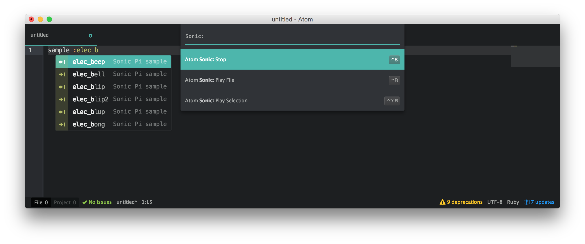

# Sonic Pi Atom integration

This plugin allows remote controlling [Sonic Pi](http://sonic-pi.net/) via [Atom](https://atom.io/).

Sonic Pi is fun to play with, but its built-in editor is very rudimentary.
With this plugin, you can do all the live coding in Atom instead.

## Requirements

Sonic Pi needs to be running in the background.

## Default Key Bindings

 Key Binding  | Action                      | Description
--------------|-----------------------------|-----------------
 `ctrl-r`     | `atom-sonic:play-file`      | Sends content of the currently open buffer to Sonic Pi for instant playback
 `ctrl-alt-r` | `atom-sonic:play-selection` | Sends currently selected text to Sonic Pi for instant playback
 `ctrl-s`     | `atom-sonic:stop`           | Tells Sonic Pi to stop all playback
